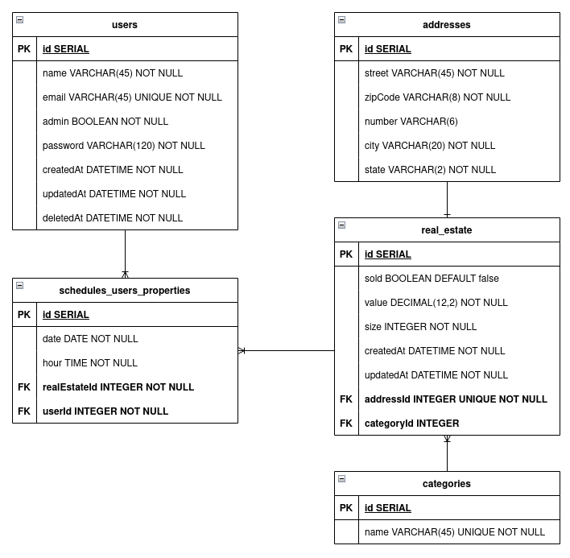
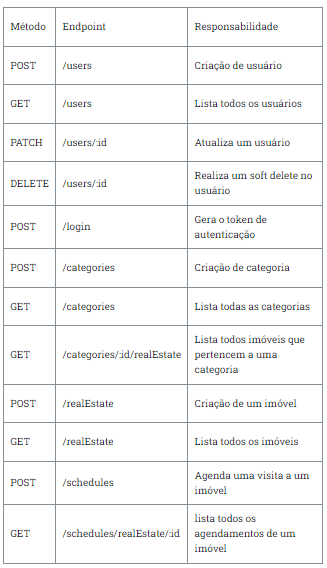
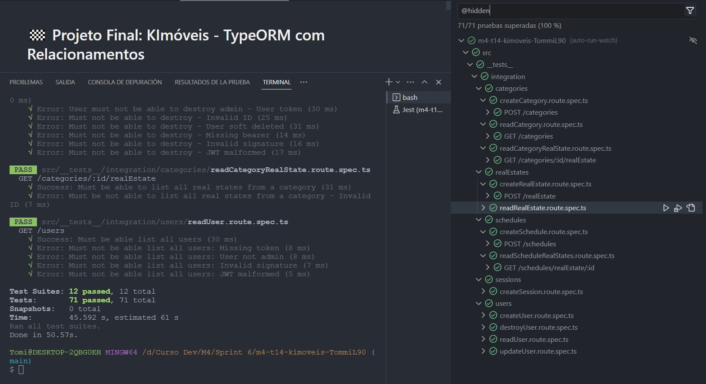

# 🏁 Projeto Final: KImóveis - TypeORM com Relacionamentos



## Endpoints do serviço




## Inicio

Para inciar este projeto, é necessário instalar as dependências, que serão utilizadas nos testes. Portanto utilize o comando abaixo para instalar tais dependências:

```bash
# caso use npm
npm run i

# caso use yarn
yarn
```

## Instalação

Apenas as bibliotecas de teste, ou que os testes dependem, estão no **package.json**. Por isso, instale as dependências do projeto manualmente e não se esqueça de inicia-lo também.

```bash
# caso use npm
npm init -y

# caso use yarn
yarn init -y
```

## Requisitos do Serviço

### POST - /users

Rota para criação de usuário com os seguintes dados:

- **id**: Valor SERIAL. Não deve ser passado no body da request, e sim gerado de forma automática pelo typeORM.
- **name**: string e obrigatório.
- **email**: string, obrigatório e único.
- **password**: Deverá receber uma string mas armazenar uma hash gerada com o bcryptjs.
- **admin**: boolean e false por padrão.
- **createdAt**: Não deve ser passado mas gerado pelo typeORM.
- **updatedAt**: Não deve ser passado mas gerado pelo typeORM.
- **deletedAt**: Não deve ser passado mas gerado pelo typeORM.

A rota de criação deve retornar todos os dados, com exceção da hash de senha.
Não podem ser cadastrados dois usuários com o mesmo e-mail.

### GET - /users

A rota deve retornar todos os dados dos usuários, com exceção da hash de senha.
A rota pode ser acessada apenas por usuários administradores (admin = true).

### PATCH - /users/:id

A rota deve atualizar os dados do usuário.
Não deve ser possível atualizar os campos id e admin.
Apenas administradores podem atualizar qualquer usuário, usuários não-administradores podem apenas atualizar seu próprio usuário.

### DELETE - /users/:id

A rota deve realizar um soft delete do usuário.
A rota pode ser acessada apenas por administradores.
Não deve ser possível realizar um soft delete em um usuário já deletado.

### POST - /login

Rota de login recebendo email e password.
O login deve validar se o usuário existe e validar se a senha está correta.
Não deve ser possível realizar o login de um usuário deletado.

### POST - /categories

Rota para criação de categorias com os seguintes dados:

- **id**: Valor SERIAL. Não deve ser passado no body da request, e sim gerado de forma automática pelo typeORM.
- **name**: string e obrigatório.

Não podem ser cadastradas duas categorias com o mesmo nome.
A rota pode ser acessada apenas por usuários administradores (admin = true).

### GET - /categories

Rota deve listar todas as categorias.
A rota não precisa de autenticação para ser acessada.

### GET - /categories/:id/realEstate

Rota deve listar todos os imóveis que pertencem a uma categoria.
A rota não precisa de autenticação para ser acessada.

### POST - /realEstate

Rota para criação de um imóvel com os seguintes dados:

- **id**: Valor SERIAL. Não deve ser passado no body da request, e sim gerado de forma automática pelo typeORM.
- **value**: decimal e obrigatório.
- **size**: inteiro e obrigatório.
- **address**: um objeto com os seguintes dados:
  - **street**: string e obrigatório.
  - **zipCode**: string e obrigatório.
  - **number**: string e opcional.
  - **city**: string e obrigatório.
  - **state**: string e obrigatório.
- **categoryId**: number.
- **sold**: Não deve ser passado mas gerado no momento da validação dos dados no formato boolean com default = false.
- **createdAt**: Não deve ser passado mas gerado pelo typeORM.
- **

## Dependências dos testes

Para que os testes funcionem corretamente, existem algumas dependências.

* O `app` tem que ser exportado como **default** em **src/app.ts**. Exemplo:

```ts
export default app
```

* O `AppDataSource` tem que ser exportado em **src/data-source.ts**. Exemplo:

```ts
export { AppDataSource }

// ou

export const AppDataSource = new DataSource(dataSourceConfig());
```

* As Entities **tem que ter os respectivos nomes** e **tem que ter a exportação centralizada** em **entities/index.ts**. Exemplo:

```ts
import { Address } from './<arquivo>';
import { Category } from './<arquivo>';
import { RealEstate } from './<arquivo>';
import { Schedule } from './<arquivo>';
import { User } from './<arquivo>';

export { Address, RealEstate, Category, User, Schedule };
```

## Sobre os testes

Essa aplicação possui testes, que serão utilizados para validar, se todas as regras de negócio foram aplicadas de maneira correta.

Os testes estão localizados em `src/__tests__`.

Na subpasta `integration` estão os testes.

Já na subpasta `mocks` estão os dados que serão utilizados para os testes.

No arquivo `jest.config.ts` estão algumas configurações necessárias para os testes rodarem.

**`De modo algum altere qualquer um desses arquivos.`** Isso poderá comprometer a integridade dos testes.

E também não altere o script de `test` localizado no `package.json`. Isso será utilizado para rodar os testes.

## Rodando os testes

Para rodar os testes é necessário que no seu terminal, você esteja dentro do diretório do projeto.

Estando no terminal e dentro do caminho correto, você poderá utilizar os comandos a seguir:

### Rodar todos os testes

```bash
# caso use npm
npm run test

# caso use yarn
yarn test
```

### Rodar todos os testes e ter um log ainda mais completo

```bash
# caso use npm
npm run test --all

# caso use yarn
yarn test --all
```

### Rodar os testes de uma pasta específica

> detalhe: repare que tests está envolvido por 2 underlines. Isso se chama ***dunder***.

```bash
# caso use npm
npm run test <subpasta>

# caso use yarn
yarn test <subpasta>
```

### Rodar os testes de um arquivo específico

```bash
# caso use npm
npm run test <subpasta>/<arquivo>

# caso use yarn
yarn test <subpasta>/<arquivo>
```

**Caso você queira verificar todas as opções de execução de testes, visite a [Documentação oficial do Jest](https://jestjs.io/docs/cli)**

Após rodar um dos comandos aparecerá um log no seu terminal, contendo as informações da execução do teste.

**Observação:** O teste pode demorar alguns segundos para ser finalizado. Quanto maior for o teste, mais tempo será consumido para a execução.

### Resultado




